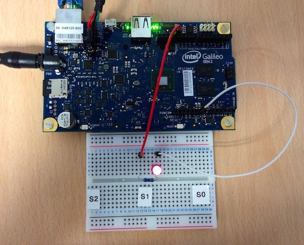

Wiring-x86
==========

Wiring-x86 is a Python module that lets you use Arduino like functionality on
Intel® Arduino capable boards such as:

* `Intel® Edison <http://www.intel.com/content/www/us/en/do-it-yourself/edison.html>`_
* `Intel® Galileo Gen2 <http://www.intel.com/content/www/us/en/do-it-yourself/galileo-maker-quark-board.html>`_ 
* `Intel® Galileo <http://www.intel.ie/content/www/ie/en/do-it-yourself/galileo-maker-quark-board.html>`_

It provides a simple and unified API (similar to the WiringPi module) to talk
to the GPIO pins on the board.

At the moment the Wiring-x86 library provides support to:

*  Writing to a GPIO pin configured as output.
*  Reading from a GPIO pin configured as high impedance input.
*  Reading from a GPIO pin configured as pullup input.
*  Reading from a GPIO pin configured as pulldown input.
*  Reading from a GPIO pin configured as analog input (ADC).
*  Writing to a GPIO pin configured as analog output (PWM).

Here is a simple example::

    # Import the time module enable sleeps between turning the led on and off.
    import time

    # Import the GPIOEdison class from the wiringx86 module.
    # In case you want to use a different board, simply the import right class
    # below. The API is unified for all supported boards.
    from wiringx86 import GPIOEdison as GPIO

    # Create a new instance of the GPIOEdison class.
    # Setting debug=True gives information about the interaction with sysfs.
    gpio = GPIO(debug=False)
    pin = 13
    state = gpio.HIGH

    # Set pin 13 to be used as an output GPIO pin.
    print 'Setting up pin %d' % pin
    gpio.pinMode(pin, gpio.OUTPUT)

    print 'Blinking pin %d now...' % pin
    try:
        while(True):
            # Write a state to the pin. ON or OFF.
            gpio.digitalWrite(pin, state)

            # Toggle the state.
            state = gpio.LOW if state == gpio.HIGH else gpio.HIGH

            # Sleep for a while.
            time.sleep(0.5)

    # When you get tired of seeing the led blinking kill the loop with Ctrl-C.
    except KeyboardInterrupt:
        # Leave the led turned off.
        print '\nCleaning up...'
        gpio.digitalWrite(pin, gpio.LOW)

        # Do a general cleanup. Calling this function is not mandatory.
        gpio.cleanup()

Contents:

.. toctree::
   :maxdepth: 1

   getting_started.rst
   api_reference.rst
   examples.rst
   learn_more.rst
